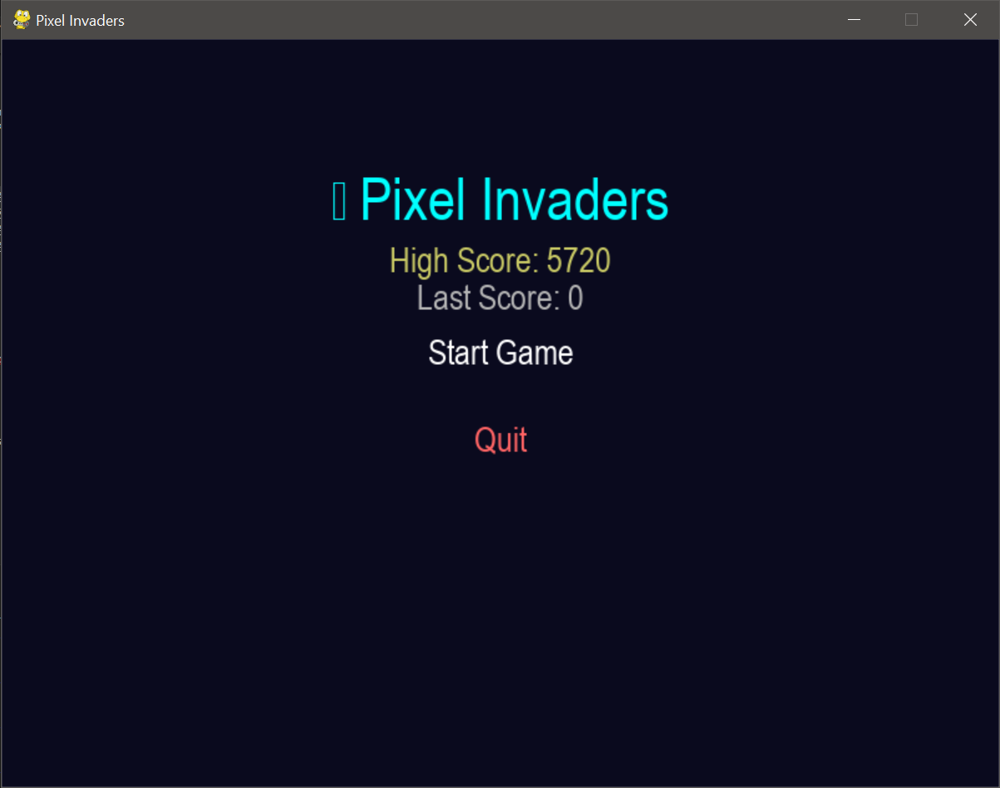
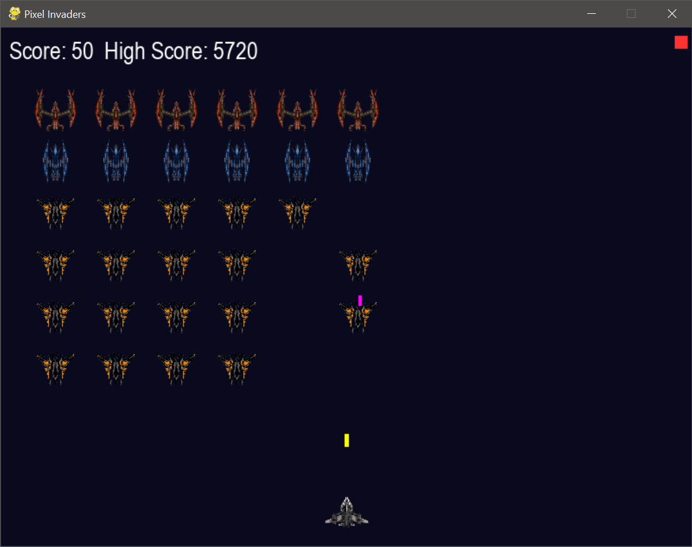
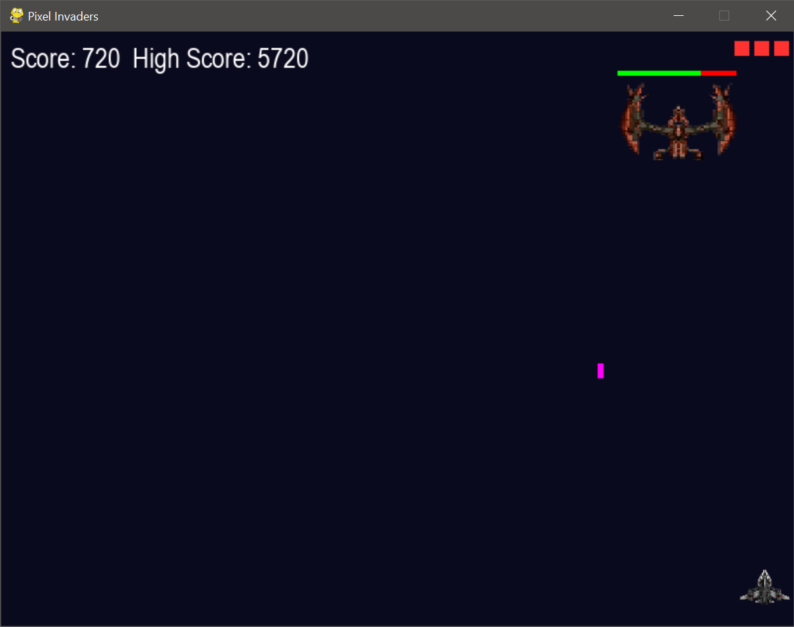
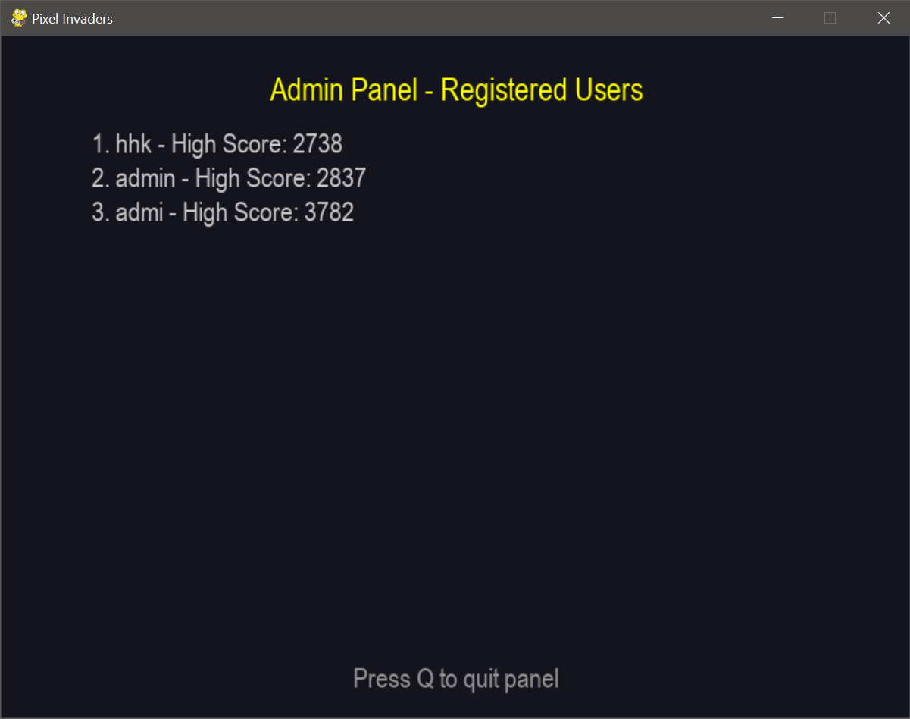

# 🚀 Pixel Invaders

Pixel Invaders is a retro-style space shooter game built using Python and Pygame. The game features an account system, boss fights, power-ups, level progression, and user high scores — all stored locally.

## 🎮 Features

- 👤 **Login & Signup System**
  - Register and log in with username and password
  - Password masking for secure input
  - CSV-based user database
- 🕹️ **Game Mechanics**
  - Move and shoot to eliminate waves of enemies
  - Randomized enemy waves per level
  - Power-ups: double shot, shield, slow enemies
  - Boss appears every 3 levels with health bar
  - Bullet collision, player lives, and health system
- 🧱 **Progressive Levels**
  - Each level increases in difficulty
  - Boss must be defeated to advance
- 💾 **Score Management**
  - Saves high score per user
  - Tracks last score and shows on home screen
- 🧑‍💼 **Admin Panel**
  - Admin account (`admin`) can view all users and their scores
  - Export user data to JSON file (`auth/user_data.json`)
- 🖼️ **Sprite Support**
  - Custom player and enemy images
  - Boss sprite animation and scaling
- 🖱️ **Modern UI**
  - Home screen with clickable buttons
  - Animated powerups and smooth game transitions

## 🗂️ Folder Structure

```

PixelInvaders/
├── assets/               # Player, enemy, boss sprites
├── auth/
│   ├── auth\_utils.py     # Login/signup logic
│   ├── user\_data.csv     # User credentials & scores
│   └── user\_data.json    # Exported JSON version
├── ui/
│   ├── button.py         # Reusable UI button class
│   └── input\_box.py      # Input fields for username/password
├── game/
│   ├── config.py         # Game constants and settings
│   ├── utils.py          # Image loading and file I/O
│   ├── enemy\_manager.py  # Random enemy spawner
│   ├── powerups.py       # Power-up logic
│   ├── boss.py           # Boss class with health and attack
│   └── space\_game.py     # Main game class (PixelInvadersGame)
└── main.py               # Entry point

```


## 🧪 Requirements

- Python 3.8+
- Pygame (`pip install pygame`)

## 🚀 How to Run

1. Clone the repository or download the ZIP
2. Install dependencies:
   ```bash
   pip install pygame
   ```

3. Run the game:

   ```bash
   python main.py
   ```

## 👤 Default Admin Login

* Username: `admin`
* Password: `admin` (or whatever you registered)
* Press `E` in the Admin Panel to export users to JSON

## 📸 Screenshots






## 🧠 Future Plans

* 🎨 Theme selector
* 🎵 Music and SFX toggle
* 🔐 Password reset
* 🌐 Online scoreboard support

## 🙌 Credits

* Developed with 💙 using [Python](https://www.python.org/) and [Pygame](https://www.pygame.org/)
* Sprites: Custom & open-source assets from [Kenney.nl](https://kenney.nl/)
